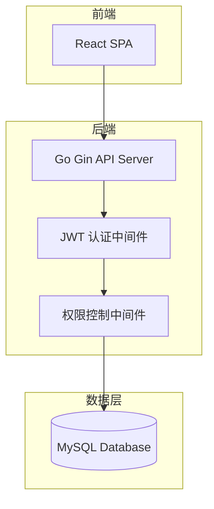
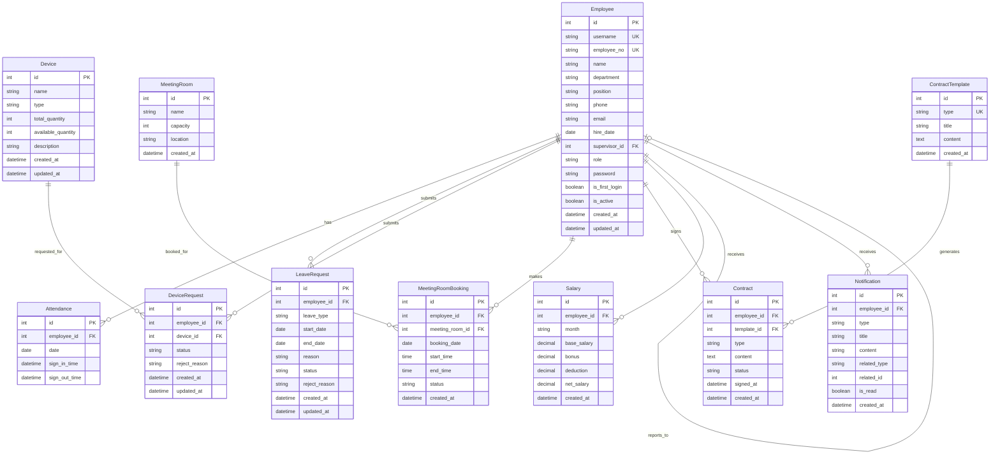

# 设计文档

## 概述

本设计文档描述简易 OA 系统的技术架构和实现方案。系统采用前后端分离架构，后端使用 Go 语言提供 RESTful API，前端使用 React 构建单页应用，数据存储使用 MySQL 数据库。

## 架构

### 整体架构



### 技术栈

- **前端**: React 18 + TypeScript + Tailwind CSS v4 + shadcn/ui
- **后端**: Go + Gin + GORM
- **数据库**: MySQL 8.0
- **认证**: JWT (JSON Web Token)
- **测试**: Go testing + rapid（属性测试）

## 组件和接口

### 后端模块结构

```
backend/
├── cmd/
│   └── server/
│       └── main.go           # 应用入口
├── internal/
│   ├── handler/              # 控制器层（HTTP 处理器）
│   │   ├── auth.go
│   │   ├── employee.go
│   │   ├── attendance.go
│   │   ├── leave.go
│   │   ├── device.go
│   │   ├── meeting_room.go
│   │   ├── contract.go
│   │   ├── salary.go
│   │   └── notification.go
│   ├── service/              # 业务逻辑层
│   │   ├── auth.go
│   │   ├── employee.go
│   │   ├── attendance.go
│   │   ├── leave.go
│   │   ├── device.go
│   │   ├── meeting_room.go
│   │   ├── contract.go
│   │   ├── salary.go
│   │   └── notification.go
│   ├── repository/           # 数据访问层
│   │   ├── employee.go
│   │   ├── attendance.go
│   │   ├── leave.go
│   │   ├── device.go
│   │   ├── meeting_room.go
│   │   ├── contract.go
│   │   ├── salary.go
│   │   └── notification.go
│   ├── middleware/           # 中间件
│   │   ├── auth.go
│   │   └── rbac.go
│   └── model/                # 数据模型
│       └── models.go
├── pkg/
│   ├── jwt/                  # JWT 工具
│   │   └── jwt.go
│   └── password/             # 密码工具
│       └── password.go
├── config/
│   └── config.go             # 配置管理
├── migrations/
│   └── init.sql              # 数据库初始化脚本（含预设超管账号、合同模板）
└── go.mod
```

### 前端模块结构

```
frontend/
├── src/
│   ├── components/           # 通用组件
│   │   ├── ui/               # shadcn/ui 组件
│   │   ├── Layout.tsx        # 布局组件
│   │   └── PrivateRoute.tsx  # 权限路由组件
│   ├── pages/                # 页面组件
│   │   ├── auth/
│   │   │   ├── Login.tsx           # 登录页
│   │   │   └── ChangePassword.tsx  # 修改密码页
│   │   ├── dashboard/
│   │   │   └── Dashboard.tsx       # 仪表盘
│   │   ├── employee/
│   │   │   ├── Profile.tsx         # 个人信息
│   │   │   ├── EmployeeList.tsx    # 员工列表（HR/超管）
│   │   │   └── EmployeeForm.tsx    # 员工表单（HR/超管）
│   │   ├── attendance/
│   │   │   └── Attendance.tsx      # 考勤签到签退
│   │   ├── leave/
│   │   │   ├── LeaveList.tsx       # 我的请假记录
│   │   │   ├── LeaveForm.tsx       # 请假申请表单
│   │   │   └── LeaveApproval.tsx   # 请假审批（主管）
│   │   ├── device/
│   │   │   ├── DeviceList.tsx      # 设备列表
│   │   │   ├── DeviceForm.tsx      # 设备表单（设备管理员）
│   │   │   ├── DeviceRequest.tsx   # 我的设备申请
│   │   │   └── DeviceApproval.tsx  # 设备审批（设备管理员）
│   │   ├── meeting-room/
│   │   │   ├── MeetingRoomList.tsx # 会议室列表
│   │   │   ├── MeetingRoomForm.tsx # 会议室表单（超管）
│   │   │   ├── BookingCalendar.tsx # 预定日历
│   │   │   └── MyBookings.tsx      # 我的预定
│   │   ├── contract/
│   │   │   ├── ContractList.tsx    # 合同列表（HR）
│   │   │   ├── ContractForm.tsx    # 合同表单（HR）
│   │   │   └── MyContracts.tsx     # 我的合同
│   │   ├── salary/
│   │   │   ├── SalaryList.tsx      # 工资列表（财务）
│   │   │   ├── SalaryForm.tsx      # 工资表单（财务）
│   │   │   └── MySalary.tsx        # 我的工资
│   │   └── notification/
│   │       └── NotificationList.tsx # 通知列表
│   ├── hooks/                # 自定义 Hooks
│   │   ├── useAuth.ts        # 认证 Hook
│   │   └── usePermission.ts  # 权限 Hook
│   ├── services/             # API 调用
│   │   ├── api.ts            # Axios 实例
│   │   ├── auth.ts
│   │   ├── employee.ts
│   │   ├── attendance.ts
│   │   ├── leave.ts
│   │   ├── device.ts
│   │   ├── meetingRoom.ts
│   │   ├── contract.ts
│   │   ├── salary.ts
│   │   └── notification.ts
│   ├── store/                # 状态管理
│   │   └── authStore.ts      # 认证状态
│   ├── types/                # TypeScript 类型
│   │   └── index.ts
│   ├── lib/                  # 工具函数
│   │   └── utils.ts
│   ├── App.tsx
│   └── main.tsx
├── tailwind.config.ts
├── components.json           # shadcn/ui 配置
└── package.json
```

### API 接口设计

#### 认证模块
| 方法 | 路径 | 描述 | 权限 |
|------|------|------|------|
| POST | /api/auth/login | 用户登录 | 公开 |
| POST | /api/auth/change-password | 修改密码 | 已登录 |

#### 员工模块
| 方法 | 路径 | 描述 | 权限 |
|------|------|------|------|
| GET | /api/employees | 获取员工列表 | HR/超级管理员 |
| GET | /api/employees/:id | 获取员工详情 | HR/超级管理员/本人 |
| POST | /api/employees | 创建员工 | HR/超级管理员 |
| PUT | /api/employees/:id | 更新员工信息 | HR/超级管理员/本人(部分字段) |
| PUT | /api/employees/:id/role | 修改员工角色 | HR/超级管理员 |
| PUT | /api/employees/:id/supervisor | 修改直属主管 | HR/超级管理员 |
| PUT | /api/employees/:id/status | 启用/禁用账号 | HR |
| GET | /api/employees/me | 获取当前用户信息 | 已登录 |

#### 考勤模块
| 方法 | 路径 | 描述 | 权限 |
|------|------|------|------|
| POST | /api/attendance/sign-in | 签到 | 普通员工 |
| POST | /api/attendance/sign-out | 签退 | 普通员工 |
| GET | /api/attendance | 获取考勤记录 | 普通员工 |
| GET | /api/attendance/today | 获取今日考勤状态 | 普通员工 |

#### 请假模块
| 方法 | 路径 | 描述 | 权限 |
|------|------|------|------|
| POST | /api/leaves | 提交请假申请 | 普通员工 |
| GET | /api/leaves | 获取请假记录 | 普通员工 |
| GET | /api/leaves/pending | 获取待审批申请 | 主管 |
| PUT | /api/leaves/:id/approve | 批准请假 | 主管 |
| PUT | /api/leaves/:id/reject | 拒绝请假 | 主管 |
| PUT | /api/leaves/:id/cancel | 取消请假 | 普通员工/主管 |

#### 设备模块
| 方法 | 路径 | 描述 | 权限 |
|------|------|------|------|
| GET | /api/devices | 获取设备列表 | 普通员工 |
| POST | /api/devices | 添加设备 | 设备管理员 |
| PUT | /api/devices/:id | 更新设备 | 设备管理员 |
| DELETE | /api/devices/:id | 删除设备 | 设备管理员 |
| POST | /api/device-requests | 提交设备申请 | 普通员工 |
| GET | /api/device-requests | 获取设备申请记录 | 普通员工 |
| GET | /api/device-requests/pending | 获取待审批申请 | 设备管理员 |
| PUT | /api/device-requests/:id/approve | 批准申请 | 设备管理员 |
| PUT | /api/device-requests/:id/reject | 拒绝申请 | 设备管理员 |
| PUT | /api/device-requests/:id/collect | 确认领取 | 普通员工 |
| PUT | /api/device-requests/:id/return | 发起归还 | 普通员工 |
| PUT | /api/device-requests/:id/confirm-return | 确认归还 | 设备管理员 |
| PUT | /api/device-requests/:id/cancel | 取消申请 | 普通员工/设备管理员 |
| GET | /api/device-requests/return-pending | 获取待确认归还申请 | 设备管理员 |

#### 会议室模块
| 方法 | 路径 | 描述 | 权限 |
|------|------|------|------|
| GET | /api/meeting-rooms | 获取会议室列表 | 普通员工 |
| POST | /api/meeting-rooms | 添加会议室 | 超级管理员 |
| PUT | /api/meeting-rooms/:id | 更新会议室 | 超级管理员 |
| DELETE | /api/meeting-rooms/:id | 删除会议室 | 超级管理员 |
| GET | /api/meeting-rooms/:id/availability | 获取可用时间段 | 普通员工 |
| POST | /api/meeting-room-bookings | 预定会议室 | 普通员工 |
| GET | /api/meeting-room-bookings | 获取预定记录 | 普通员工 |
| PUT | /api/meeting-room-bookings/:id/complete | 标记完成 | 普通员工 |
| PUT | /api/meeting-room-bookings/:id/cancel | 取消预定 | 普通员工 |

#### 合同模块
| 方法 | 路径 | 描述 | 权限 |
|------|------|------|------|
| GET | /api/contract-templates | 获取合同模板列表 | HR |
| POST | /api/contracts | 创建合同（选择模板和员工） | HR |
| GET | /api/contracts | 获取合同列表 | HR |
| GET | /api/contracts/:id | 获取合同详情 | HR/本人 |
| GET | /api/contracts/my | 获取我的合同 | 普通员工 |
| PUT | /api/contracts/:id/sign | 签署合同 | 普通员工 |

#### 工资模块
| 方法 | 路径 | 描述 | 权限 |
|------|------|------|------|
| POST | /api/salaries | 创建工资记录 | 财务 |
| GET | /api/salaries | 获取工资记录列表 | 财务 |
| GET | /api/salaries/my | 获取我的工资记录 | 普通员工 |
| GET | /api/salaries/:id | 获取工资详情 | 财务/本人 |

#### 通知模块（可选）
| 方法 | 路径 | 描述 | 权限 |
|------|------|------|------|
| GET | /api/notifications | 获取我的通知列表 | 已登录 |
| GET | /api/notifications/unread-count | 获取未读通知数量 | 已登录 |
| PUT | /api/notifications/:id/read | 标记通知为已读 | 已登录 |
| PUT | /api/notifications/read-all | 标记所有通知为已读 | 已登录 |

> 注：通知模块为可选功能，核心业务流程不依赖通知模块。

## 数据模型

### 实体关系图



### 枚举定义

```go
// 角色
const (
    RoleSuperAdmin  = "super_admin"
    RoleHR          = "hr"
    RoleFinance     = "finance"
    RoleDeviceAdmin = "device_admin"
    RoleSupervisor  = "supervisor"
    RoleEmployee    = "employee"
)

// 请假类型
const (
    LeaveTypeAnnual      = "annual"      // 年假
    LeaveTypeSick        = "sick"        // 病假
    LeaveTypePersonal    = "personal"    // 事假
    LeaveTypeMarriage    = "marriage"    // 婚假
    LeaveTypeMaternity   = "maternity"   // 产假
    LeaveTypeBereavement = "bereavement" // 丧假
)

// 请假状态
const (
    LeaveStatusPending   = "pending"
    LeaveStatusApproved  = "approved"
    LeaveStatusRejected  = "rejected"
    LeaveStatusCancelled = "cancelled"
)

// 设备申请状态
const (
    DeviceRequestStatusPending       = "pending"
    DeviceRequestStatusApproved      = "approved"
    DeviceRequestStatusRejected      = "rejected"
    DeviceRequestStatusCollected     = "collected"
    DeviceRequestStatusReturnPending = "return_pending"
    DeviceRequestStatusReturned      = "returned"
    DeviceRequestStatusCancelled     = "cancelled"
)

// 会议室预定状态
const (
    BookingStatusActive    = "active"
    BookingStatusCompleted = "completed"
    BookingStatusCancelled = "cancelled"
)

// 合同类型
const (
    ContractTypeOnboarding  = "onboarding"  // 入职合同
    ContractTypeOffboarding = "offboarding" // 离职合同
)

// 合同状态
const (
    ContractStatusPending = "pending"
    ContractStatusSigned  = "signed"
)
```

## 正确性属性

*属性是系统在所有有效执行中应保持为真的特征或行为——本质上是关于系统应该做什么的形式化陈述。属性作为人类可读规范和机器可验证正确性保证之间的桥梁。*

### Property 1: 首次登录强制改密
*对于任意*标记为首次登录的员工账号，登录后系统应阻止访问其他功能直到密码修改完成
**验证: 需求 1.1, 1.2**

### Property 2: 登录认证
*对于任意*用户名和密码组合，当且仅当用户名存在、密码正确且账号未禁用时，登录应成功
**验证: 需求 1.5, 1.6, 1.7**

### Property 3: 员工信息字段编辑限制
*对于任意*员工，当员工尝试更新个人信息时，系统管理字段（工号、入职日期、部门、职位、直属主管）应保持不变
**验证: 需求 2.3**

### Property 4: 工资记录数据隔离
*对于任意*员工查询工资记录，返回的所有记录应仅属于该员工
**验证: 需求 3.3**

### Property 5: 工资记录排序
*对于任意*员工的工资记录列表，记录应按月份降序排列
**验证: 需求 3.1**

### Property 6: 签到幂等性
*对于任意*员工在同一天，第一次签到应成功，后续签到尝试应被拒绝
**验证: 需求 4.1, 4.3**

### Property 7: 签退前置条件
*对于任意*员工在任意一天，签退操作应仅在当天已签到的情况下成功
**验证: 需求 4.2, 4.4**

### Property 8: 请假申请状态机
*对于任意*请假申请，状态转换应遵循：待审批 → (已批准|已拒绝|已取消)，且已批准/已拒绝/已取消状态不可再转换
**验证: 需求 5.3, 5.4, 5.7, 5.8**

### Property 9: 主管只能查看下属请假
*对于任意*主管查看待审批请假申请，返回的所有申请应仅来自其直属下属
**验证: 需求 5.2**

### Property 10: 设备可用数量一致性
*对于任意*设备，可用数量应等于总数量减去已领取未归还的数量
**验证: 需求 7.5, 7.7**

### Property 11: 设备申请状态机
*对于任意*设备申请，状态转换应遵循有效路径：待审批 → (已批准|已拒绝|已取消)，已批准 → 已领取，已领取 → 待确认归还，待确认归还 → 已归还
**验证: 需求 7.3, 7.4, 7.5, 7.6, 7.7, 7.9, 7.10**

### Property 12: 会议室预定冲突检测
*对于任意*会议室和时间段，如果该时间段已有活跃预定，新的预定请求应被拒绝
**验证: 需求 8.5, 8.6**

### Property 13: 员工单预定限制
*对于任意*员工，当存在活跃状态的会议室预定时，新的预定请求应被拒绝
**验证: 需求 8.8**

### Property 14: 会议室预定取消释放时间段
*对于任意*活跃状态的会议室预定，取消后该时间段应可被其他员工预定
**验证: 需求 8.11**

### Property 15: 工资记录唯一性
*对于任意*员工和月份组合，系统中应最多存在一条工资记录
**验证: 需求 10.2**

### Property 16: 员工工号唯一性
*对于任意*两个不同的员工，其工号应不相同
**验证: 需求 11.3**

### Property 17: 角色权限继承
*对于任意*非普通员工角色的用户，应拥有普通员工的所有权限
**验证: 需求 12.1-12.6**

### Property 18: 权限访问控制
*对于任意*用户和功能，当用户角色不包含该功能权限时，访问应被拒绝
**验证: 需求 12.7**

## 错误处理

### HTTP 状态码

| 状态码 | 含义 | 使用场景 |
|--------|------|----------|
| 200 | 成功 | 请求成功处理 |
| 201 | 已创建 | 资源创建成功 |
| 400 | 错误请求 | 参数验证失败、业务规则违反 |
| 401 | 未授权 | 未登录或 token 无效 |
| 403 | 禁止访问 | 权限不足 |
| 404 | 未找到 | 资源不存在 |
| 409 | 冲突 | 资源冲突（如重复创建） |
| 500 | 服务器错误 | 内部错误 |

### 错误响应格式

```go
type ErrorResponse struct {
    Code    string      `json:"code"`    // 错误代码
    Message string      `json:"message"` // 错误信息
    Details interface{} `json:"details,omitempty"` // 详细信息（可选）
}
```

### 业务错误代码

| 错误代码 | 描述 |
|----------|------|
| AUTH_INVALID_CREDENTIALS | 用户名或密码错误 |
| AUTH_ACCOUNT_DISABLED | 账号已禁用 |
| AUTH_FIRST_LOGIN_REQUIRED | 需要首次登录改密 |
| AUTH_PASSWORD_INVALID | 密码不符合要求 |
| ATTENDANCE_ALREADY_SIGNED_IN | 今日已签到 |
| ATTENDANCE_NOT_SIGNED_IN | 未签到不能签退 |
| LEAVE_INVALID_STATUS | 请假状态不允许此操作 |
| DEVICE_NOT_AVAILABLE | 设备不可用 |
| DEVICE_REQUEST_INVALID_STATUS | 设备申请状态不允许此操作 |
| BOOKING_CONFLICT | 会议室预定时间冲突 |
| BOOKING_LIMIT_EXCEEDED | 已有活跃预定，不能再预定 |
| SALARY_DUPLICATE | 该员工该月工资已存在 |

## 测试策略

### 单元测试

使用 Go 标准库 testing 进行单元测试，覆盖：
- 业务逻辑层（Services）
- 工具函数（pkg/）
- 数据验证逻辑

### 属性测试

使用 [pgregory.net/rapid](https://github.com/flyingmutant/rapid) 进行属性测试，验证系统的正确性属性。每个属性测试应：
- 运行至少 100 次迭代
- 使用注释标记对应的正确性属性
- 格式：`**Feature: simple-oa-system, Property {number}: {property_text}**`

### 前端测试

使用 Vitest + React Testing Library 进行前端测试，覆盖：
- 组件渲染测试
- 用户交互测试
- API 调用 Mock 测试

### 测试覆盖范围

1. **登录认证** - Property 1, 2
2. **数据隔离** - Property 4, 9
3. **状态机转换** - Property 8, 11
4. **业务约束** - Property 3, 5, 6, 7, 10, 12, 13, 14, 15, 16
5. **权限控制** - Property 17, 18
